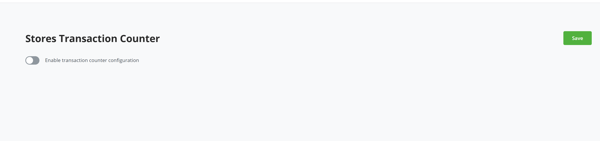
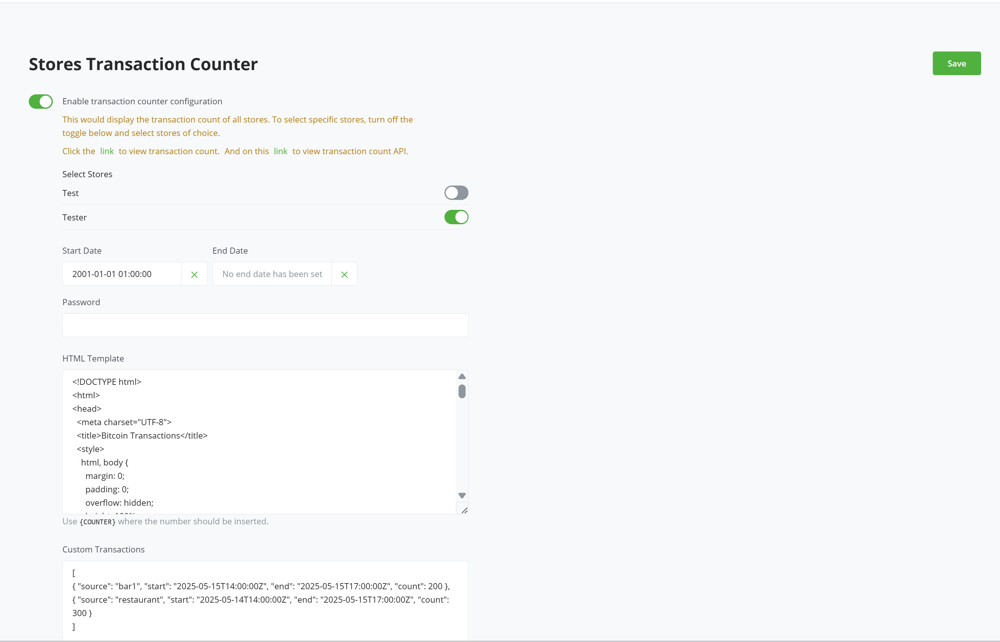

# BTCPay Server Transaction Counter

Introducing Transaction Counter plugin. A plugin that allows a server admin have a view count of all paid invoices across all stores.

These transaction counter are displayed on a public facing url

### Features

- Admin can now see a count of all paid invoices across all stores
- Admin can select which stores they want to exclude from the count
- Admin have an option to filter by start date and optional end date.
- Optional: admin can protect the url with a custom password field
- Admin can use custom defined HTML template of their choice to view data.

## License

https://github.com/rockstardev/BTCPayServerPlugins.RockstarDev/blob/master/LICENSE
